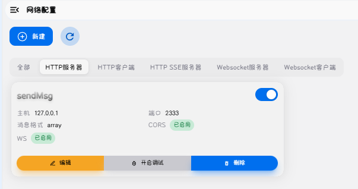
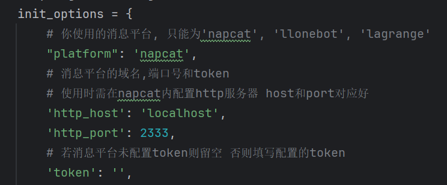
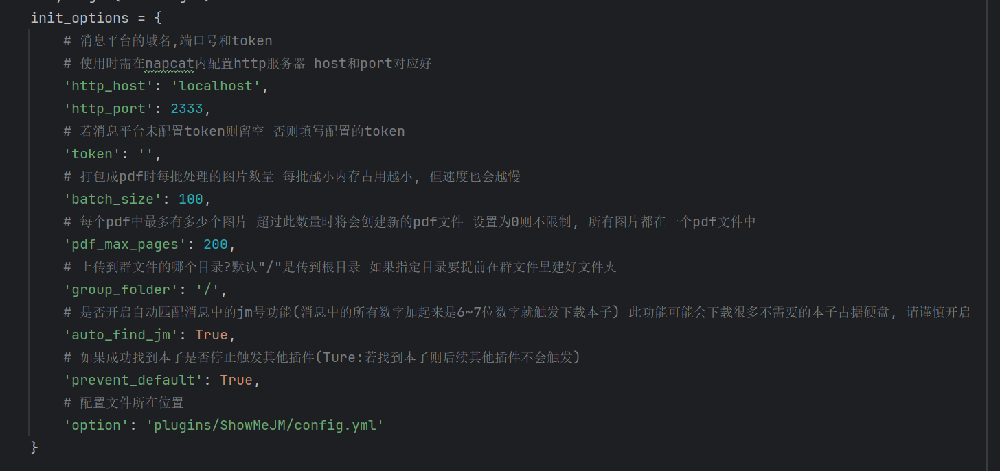
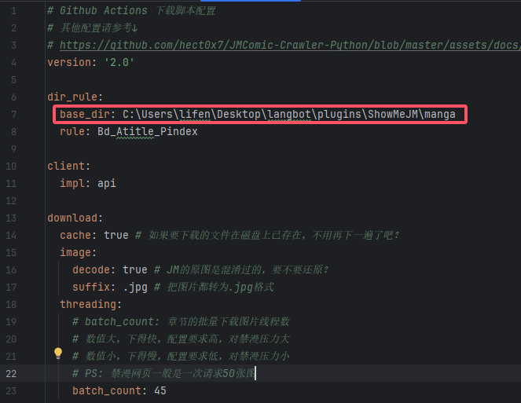
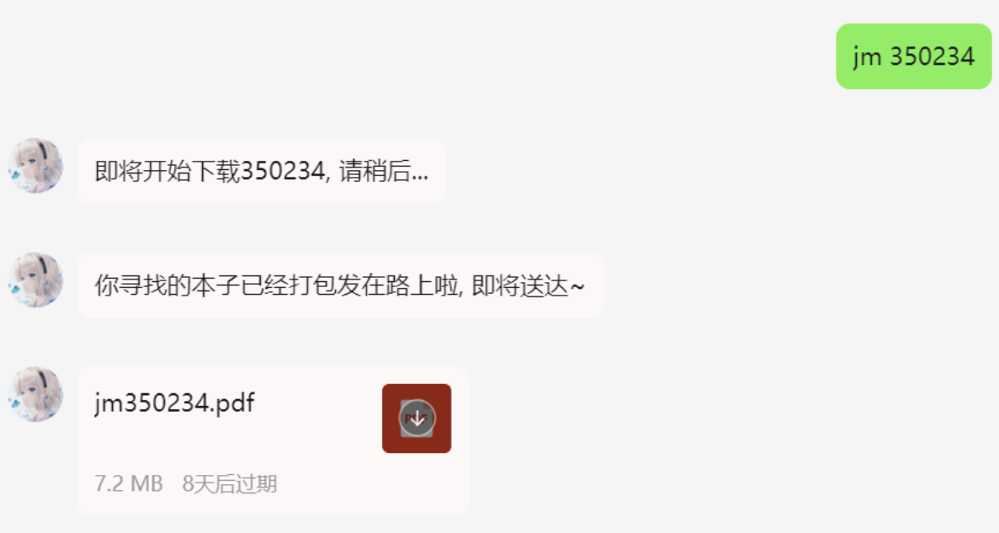
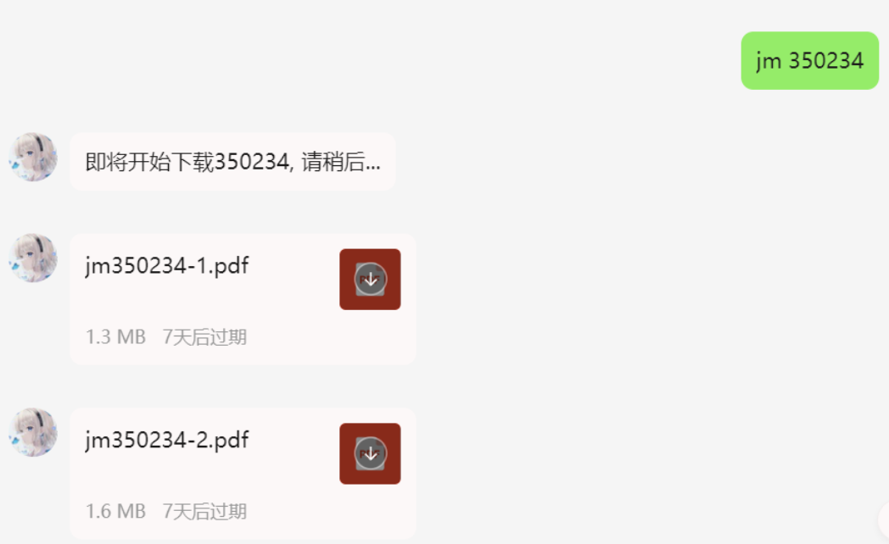
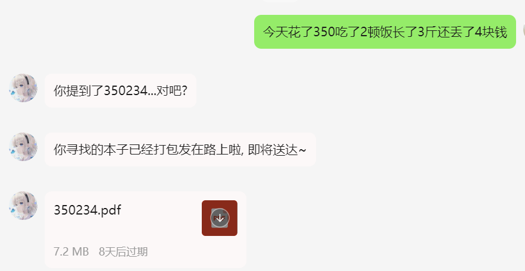
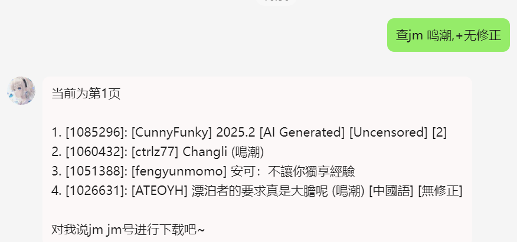
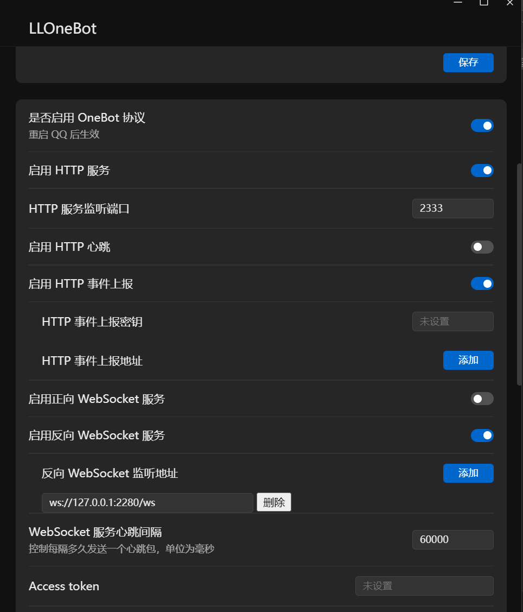

# ShowMeJM

## 介绍
这是可以帮你下载漫画并发送给QQ的插件, 本插件仅包含图片打包和上传功能, 请不要使用此插件向其他人传播不和谐的内容

支持分批次处理图片, 分批打包, 支持可配置每批数量, 内存占用↓↓

## 鸣谢

感谢[JMComic-Crawler-Python](https://github.com/hect0x7/JMComic-Crawler-Python)项目提供的JM相关API

参考了[image2pdf](https://github.com/salikx/image2pdf)部分图片转pdf的代码

感谢[drdon1234](https://github.com/drdon1234)贡献的获取随机漫画功能

## 安装

配置完成 [LangBot](https://github.com/RockChinQ/LangBot) 主程序后使用管理员账号向机器人发送命令即可安装：

```
!plugin get https://github.com/exneverbur/ShowMeJM
```
或查看详细的[插件安装说明](https://docs.langbot.app/plugin/plugin-intro.html#%E6%8F%92%E4%BB%B6%E7%94%A8%E6%B3%95)

## 使用

<!-- 插件开发者自行填写插件使用说明 -->

消息平台功能支持情况(lagrange上传文件实测不是很稳定,建议使用其他两个)

| 消息平台     | 下载漫画 | 查询漫画 | 发送私聊文件 | 发送群聊文件 |
|:---------|:----:|:----:|:------:|:------:|
| napcat   |  √   |  √   |   √    |   √    |
| llonebot |   √   |    √  |   √    |   √     |
|    lagrange      |    √   |   √    |   ×    |     √    |


### 配置
首先要在消息平台配置http客户端

napcat为例:

1.在网络配置中新建, 选择http服务器, 填写你的host和port(注意端口号不要被其他程序占用) 如果langbot和napcat在同一网络环境下host直接填写127.0.0.1或localhost, 配置完可以在浏览器访问一下, 比如127.0.0.1:2333, 如果返回信息里有'NapCat4 Is Running'字样说明运行正常。只要你在napcat配置的url+端口号在langbot所在的网络环境下能正常访问到就ok



2.在本项目的main.py中修改platform、http_host和http_port三个变量即可

若你在消息平台配置了token, 则也需要将同样的token添加在此处的token属性中



3.在本项目的main.py中按需调整打包参数



4.修改有关下载文件的配置(插件文件夹中的config.yml)中的文件保存路径以及其他配置, 图中框选出来的值要改成你自己本地的存储路径, 下载的图片和解析后的pdf都会存在这里 其他配置不要修改, 一定要修改请参考[此文档](https://github.com/hect0x7/JMComic-Crawler-Python/blob/master/assets/docs/sources/option_file_syntax.md)



5.你的群可能需要给bot管理员权限才能进行群文件的上传

## 指令

| 指令                       |                  含义                   |      示例      |
|:-------------------------|:-------------------------------------:|:------------:|
| jm                       |                获取指令帮助                 |      jm      |
| jm [jm号]                 |             获取并上传指定jm号的漫画             |  jm 350234   |
| 查jm [关键词/标签] [页码(默认第一页)] |                  搜索                   | 查jm 鸣潮,+长离 2 |
| 随机jm [关键词/标签]            |               随机获取一个漫画                |     随机jm     |
| jm更新域名                   |    查询当前可用域名并加进配置文件中(该方式限制ip地区但效率高)    |              |
| jm清空域名                   | 将配置文件中的域名初始化, 下载时会自动寻找域名(该方式不限ip兼容性好) |              |


## 效果
单文件打包



分批打包



自动匹配逆天文案



搜索


## 计划功能

1.下载指定章节

2.主动每日推荐

欢迎提issue, 有空闲时间时会考虑实现

## 已知BUG

1. lagrange平台上传私聊文件接口当前不可用 会报错, 待他们修复

欢迎提issue, 提交前请先更新插件版本, 以及查看以往的issue里是否有类似已解决问题。


## 其他

若api出现连接不上jm无法下载, 可能是域名没有更新导致的, 请尝试在cmd中使用下面的命令更新依赖版本

```
pip install jmcomic -i https://pypi.org/project -U
```

若还是报错 可能是装在其他python上了, 使用下面的指令指定安装到你当前的python版本上
1.查看当前使用的python版本
```
# 查看当前python版本
python --version
# 我的电脑返回 Python 3.10.10
```
2.指定安装到此版本的python上
```
py -<你的版本> -m pip install jmcomic –i https://pypi.org/project –U
# 比如我当前装的是3.10.10 则使用py -3.10 -m pip install jmcomic –i https://pypi.org/project –U
```

附上一个lagrange配置示例

```yml
# appsettings.json
"Implementations": [
        {
            "Type": "ReverseWebSocket",
            "Host": "127.0.0.1",
            "Port": 2280,
            "Suffix": "/ws",
            "ReconnectInterval": 5000,
            "HeartBeatInterval": 5000,
            "AccessToken": ""
        },
        {
            "Type": "Http",
            "Host": "127.0.0.1",
            "Port": 2333,
            "AccessToken": ""
        }
    ]
```

还有一个llonebot配置示例



## 更新日志
v2.4
- 修改 随机jm改为除impl外其余均使用用户配置的下载配置
- 优化 随机jm现在也会显示漫画名了
- 新增 白名单功能, 在main.py配置你的qq号(person_whitelist)或群号(group_whitelist), 可以控制只在哪些群里启用本插件的功能

v2.3
- 更新 JMComic-Crawler-Python版本(新版本更新了jm的下载域名)

v2.2
- 新增 随机漫画功能
- 新增 下载配置支持相对路径
